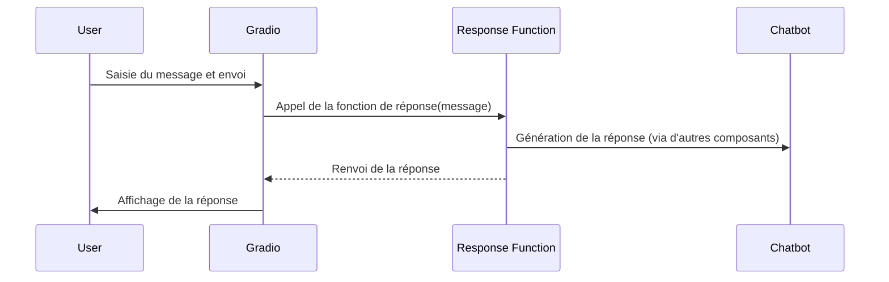

# Chapter 1: Interface utilisateur (Gradio)


Imaginez que vous voulez parler à un chatbot d'intelligence artificielle, mais que vous ne savez pas comment coder.  Vous ne voulez pas vous soucier des détails techniques, vous voulez juste pouvoir taper une question et obtenir une réponse. C'est là qu'intervient une interface utilisateur comme Gradio. C'est comme avoir un guichet automatique pour un service compliqué. Vous entrez ce que vous voulez (votre question), et il vous donne ce dont vous avez besoin (la réponse du chatbot).  Dans ce chapitre, nous allons voir comment Gradio nous aide à créer cette interface simple pour notre chatbot.

## Qu'est-ce que Gradio ?

Gradio est une bibliothèque Python qui permet de créer rapidement et facilement des interfaces utilisateur pour vos modèles de machine learning ou, dans notre cas, notre chatbot.  Pensez-y comme à un ensemble de blocs de construction préfabriqués que vous pouvez assembler pour créer une application web simple.  Sans Gradio, il faudrait beaucoup plus de travail pour créer une page web avec des zones de texte et des boutons qui fonctionnent ensemble.

## Les concepts clés de Gradio

Voici quelques concepts clés que vous devez connaître pour utiliser Gradio :

*   **Interface:** C'est le conteneur principal pour votre application Gradio.  Il définit la mise en page de votre interface utilisateur et comment les différents composants interagissent. Dans notre cas, c'est la définition de la page web du chatbot.
*   **Composants:** Ce sont les éléments individuels de votre interface utilisateur, tels que les zones de texte, les boutons, les images, etc. Gradio fournit une variété de composants pré-construits que vous pouvez utiliser.  Nous utiliserons `Textbox` pour l'entrée de l'utilisateur et `Chatbot` pour afficher la conversation.
*   **Fonctions:** C'est le code Python qui sera exécuté lorsque l'utilisateur interagit avec votre interface utilisateur.  Par exemple, la fonction qui prendra la question de l'utilisateur, l'enverra au chatbot et affichera la réponse.

## Utilisation de Gradio pour notre chatbot

Voyons comment nous pouvons utiliser Gradio pour créer une interface simple pour notre chatbot.  Voici un exemple minimal :

```python
import gradio as gr

def echo(message, history):
    return message

demo = gr.ChatInterface(echo)

if __name__ == "__main__":
    demo.launch()
```

Ce code crée une interface de chatbot très simple. Lorsque vous tapez un message et l'envoyez, il réapparaît simplement comme réponse. C'est comme si le chatbot répétait ce que vous dites.

**Explication du code :**

1.  `import gradio as gr`: importe la bibliothèque Gradio.
2.  `def echo(message, history)`: définit une fonction qui prend le message de l'utilisateur et l'historique des conversations (que nous n'utilisons pas ici) et renvoie le message. C'est la fonction de base qui traite l'entrée et génère une "réponse".
3.  `demo = gr.ChatInterface(echo)`: Crée une interface de chatbot en utilisant la fonction `echo`.  `gr.ChatInterface` est un composant Gradio pré-construit conçu spécifiquement pour les chatbots.
4.  `demo.launch()`: Lance l'interface utilisateur dans votre navigateur web.

Si vous exécutez ce code, vous verrez une simple fenêtre de chatbot dans votre navigateur.  Vous pouvez taper un message et le chatbot le répétera. C'est un exemple très simple, mais il montre les bases de l'utilisation de Gradio.

Maintenant, regardons comment l'intégration Gradio est faite dans le code de notre chatbot.

```python
# Gradio interface
with gr.Blocks() as demo:
    gr.Markdown("## ChatBot : Formation assisté par  IA ")
    chatbot = gr.Chatbot()
    state = gr.State([])

    with gr.Row():
        txt_input = gr.Textbox(
            show_label=False,
            placeholder="Ask your question...",
            container=False
        )
        send_btn = gr.Button("Send")

    def user_interaction(user_message, history):
        response = generate_response(user_message)
        history.append((user_message, response))
        return "", history

    txt_input.submit(user_interaction, [txt_input, state], [
                     txt_input, chatbot])
    send_btn.click(user_interaction, [txt_input, state], [txt_input, chatbot])

if __name__ == "__main__":
    demo.launch()
```

**Explication du code:**

1.  `with gr.Blocks() as demo:`:  Crée un bloc d'interface Gradio. Les blocs permettent une plus grande flexibilité dans la conception de l'interface utilisateur.

2.  `gr.Markdown("## ChatBot : Formation assisté par  IA ")`: Ajoute un titre à l'interface utilisateur.

3.  `chatbot = gr.Chatbot()`: Crée un composant chatbot. C'est là où les messages de l'utilisateur et les réponses du chatbot seront affichés.

4.  `state = gr.State([])`: Maintient un état pour l'interface. Dans ce cas, il est utilisé pour stocker l'historique des conversations.

5.  `with gr.Row():`: Organise les composants dans une ligne.

6.  `txt_input = gr.Textbox(...)`: Crée une zone de texte pour l'utilisateur pour entrer sa question.

7.  `send_btn = gr.Button("Send")`: Crée un bouton "Envoyer" pour soumettre la question.

8.  `def user_interaction(user_message, history):`:  Cette fonction est appelée lorsque l'utilisateur soumet une question. Elle appelle `generate_response` (que nous verrons dans les chapitres suivants) pour obtenir une réponse du chatbot, ajoute la question et la réponse à l'historique et renvoie les valeurs mises à jour pour la zone de texte et le chatbot.

9.  `txt_input.submit(user_interaction, [txt_input, state], [txt_input, chatbot])`:  Lie la soumission de la zone de texte à la fonction `user_interaction`.  Cela signifie que lorsque l'utilisateur appuie sur Entrée dans la zone de texte, la fonction `user_interaction` est appelée.

10. `send_btn.click(user_interaction, [txt_input, state], [txt_input, chatbot])`:  Lie le clic sur le bouton "Envoyer" à la fonction `user_interaction`.  Cela signifie que lorsque l'utilisateur clique sur le bouton "Envoyer", la fonction `user_interaction` est appelée.

11. `demo.launch()`: Lance l'interface utilisateur dans votre navigateur web.

## Comment ça marche sous le capot

Voici un aperçu simplifié du fonctionnement interne de Gradio :



En termes simples, l'utilisateur interagit avec l'interface Gradio, qui appelle une fonction pour générer une réponse du chatbot, puis affiche la réponse à l'utilisateur.

## Liens vers d'autres abstractions

Dans ce chapitre, nous avons seulement abordé l'interface utilisateur.  La fonction `generate_response` mentionnée plus haut fait appel à d'autres composants que nous explorerons dans les chapitres suivants. Nous verrons comment fonctionne [Modèle de langage (ChatGroq)](02_modèle_de_langage__chatgroq__.md),  [Prompt RAG](03_prompt_rag_.md), [Mémoire de conversation (ConversationBufferMemory)](04_mémoire_de_conversation__conversationbuffermemory__.md), [Récupérateur de contexte contextuel (ContextualCompressionRetriever)](05_récupérateur_de_contexte_contextuel__contextualcompressionretriever__.md) et [Base de données vectorielle (Chroma)](06_base_de_données_vectorielle__chroma__.md). Ces composants travaillent ensemble pour créer la réponse du chatbot.

## Conclusion

Dans ce chapitre, nous avons appris comment utiliser Gradio pour créer une interface utilisateur simple pour notre chatbot. Nous avons vu comment créer des zones de texte, des boutons et comment les lier à des fonctions Python.  Nous avons également examiné brièvement le fonctionnement interne de Gradio. Dans le [Modèle de langage (ChatGroq)](02_modèle_de_langage__chatgroq__.md), nous plongerons dans le cœur du chatbot : comment il comprend et génère du texte.

---

Generated by [AI Codebase Knowledge Builder](https://github.com/The-Pocket/Tutorial-Codebase-Knowledge)