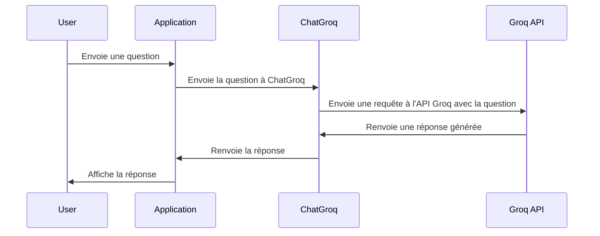

# Chapter 2: Modèle de langage (ChatGroq)

Dans le [Chapter 1: Interface utilisateur (Gradio)](01_interface_utilisateur__gradio__.md), nous avons appris à créer une interface utilisateur simple pour notre chatbot. Maintenant, plongeons au cœur de ce qui fait fonctionner un chatbot : le modèle de langage. Imaginez que l'interface utilisateur est le visage du chatbot, et le modèle de langage est son cerveau. C'est lui qui comprend vos questions et génère des réponses intelligentes.

## Pourquoi avons-nous besoin d'un modèle de langage ?

Imaginez que vous voulez demander à un chatbot : "Quel est l'intérêt de la formation assistée par l'IA ?". Sans un modèle de langage, le chatbot ne comprendrait pas votre question. Il la verrait comme un simple ensemble de mots sans lien entre eux. Un modèle de langage est comme un traducteur qui prend votre question et la transforme en quelque chose que l'ordinateur peut comprendre. Et, tout aussi important, il transforme la "pensée" de l'ordinateur en une réponse que vous pouvez comprendre.

Le modèle de langage que nous utilisons ici est ChatGroq, qui utilise le modèle llama-3.3-70b-versatile.  C'est un peu comme avoir un expert dans votre poche, prêt à répondre à toutes vos questions sur la formation et l'IA.

## Qu'est-ce qu'un modèle de langage ?

Un modèle de langage est un programme informatique qui a été entraîné sur une énorme quantité de texte. Il a lu des millions de pages de livres, d'articles, de sites web, etc. Grâce à cette lecture intensive, il a appris à :

*   **Comprendre le langage humain :** Il peut analyser la structure des phrases, identifier les mots clés et comprendre le sens général de ce que vous dites.
*   **Générer du langage humain :** Il peut écrire des phrases grammaticalement correctes et qui ont du sens, en utilisant le vocabulaire approprié.

Pensez-y comme à un enfant qui apprend à parler. Au début, il ne connaît que quelques mots. Mais au fur et à mesure qu'il entend de plus en plus de gens parler, il apprend à comprendre de plus en plus de mots et à les utiliser pour former des phrases. Un modèle de langage fait la même chose, mais à une échelle beaucoup plus grande.

Dans notre cas, ChatGroq est ce "cerveau" qui comprend les questions et génère les réponses. Il utilise le modèle llama-3.3-70b-versatile, qui est un modèle de langage très puissant développé par Meta.

## Utilisation de ChatGroq dans notre chatbot

Voici comment nous utilisons ChatGroq dans notre code :

```python
from langchain_groq import ChatGroq

GROQ_API_KEY = ""  # Ajoutez votre clé API Groq ici

llm_response = ChatGroq(
    temperature=0, model="llama-3.3-70b-versatile", api_key=GROQ_API_KEY)
```

**Explication du code :**

1.  `from langchain_groq import ChatGroq`: importe la classe `ChatGroq` de la bibliothèque `langchain-groq`. `langchain-groq` est une bibliothèque qui nous permet de nous connecter facilement aux modèles de langage de Groq.
2.  `GROQ_API_KEY = ""`: Définie une variable pour stocker votre clé API Groq. Vous devez obtenir une clé API de Groq pour utiliser leurs modèles de langage.
3.  `llm_response = ChatGroq(...)`: Crée une instance de la classe `ChatGroq`. Cela crée une connexion à un modèle de langage Groq spécifique. Nous spécifions la température à 0 pour des réponses plus déterministes, et nous spécifions le modèle que nous voulons utiliser (llama-3.3-70b-versatile) et la clé API.

Maintenant, quand nous voulons générer une réponse, nous pouvons faire ceci :

```python
from langchain.schema import HumanMessage

response = llm_response([HumanMessage(content="Quel est l'intérêt de la formation assistée par l'IA ?")]).content
print(response)
```

**Explication du code :**

1. `from langchain.schema import HumanMessage`: Importe la classe `HumanMessage` pour spécifier le message de l'utilisateur.
2. `response = llm_response([HumanMessage(content="...")])`: Envoie une question à ChatGroq. Nous créons un `HumanMessage` avec la question, et nous l'envoyons à `llm_response`. `llm_response` renvoie un objet contenant la réponse.
3. `print(response)`: Affiche la réponse du modèle.

Si vous exécutez ce code (après avoir défini votre clé API Groq), vous devriez voir une réponse du modèle de langage expliquant l'intérêt de la formation assistée par l'IA.  Par exemple, vous pourriez voir quelque chose comme : "La formation assistée par l'IA offre une personnalisation accrue, une efficacité améliorée et un meilleur engagement des apprenants."

## Comment ça marche sous le capot

Voici un aperçu simplifié du fonctionnement interne de ChatGroq :



En termes simples, l'application prend la question de l'utilisateur et l'envoie à ChatGroq. ChatGroq contacte l'API Groq avec la question, reçoit une réponse générée par le modèle de langage, puis renvoie la réponse à l'application, qui l'affiche à l'utilisateur.

Plus précisément, dans le code `chatbot.py`, la génération de la réponse s'effectue dans la fonction `generate_response`:

```python
def generate_response(user_message):
    conversation_history = memory.buffer
    context = retrieve_context(user_message)

    prompt = rag_prompt.format(
        history=conversation_history,
        context=context,
        question=user_message
    )

    response = llm_response([HumanMessage(content=prompt)]).content
    memory.save_context({"input": user_message}, {"output": response})
    return response
```

**Explication du code :**

1.  `conversation_history = memory.buffer`: Récupère l'historique de la conversation depuis la [Mémoire de conversation (ConversationBufferMemory)](04_mémoire_de_conversation__conversationbuffermemory__.md).
2.  `context = retrieve_context(user_message)`: Récupère le contexte pertinent depuis la [Base de données vectorielle (Chroma)](06_base_de_données_vectorielle__chroma__.md) en utilisant le [Récupérateur de contexte contextuel (ContextualCompressionRetriever)](05_récupérateur_de_contexte_contextuel__contextualcompressionretriever__.md).
3.  `prompt = rag_prompt.format(...)`: Formate le prompt en utilisant l'historique de la conversation, le contexte et la question de l'utilisateur.  Nous parlerons plus en détail des prompts dans le [Prompt RAG](03_prompt_rag_.md).
4.  `response = llm_response([HumanMessage(content=prompt)]).content`: Envoie le prompt formaté à ChatGroq et récupère la réponse. C'est ici que ChatGroq utilise le modèle llama-3.3-70b-versatile pour générer une réponse basée sur le prompt.
5.  `memory.save_context(...)`: Sauvegarde la question et la réponse dans la mémoire de conversation.
6.  `return response`: Renvoie la réponse générée.

## Liens vers d'autres abstractions

Comme vous pouvez le voir, ChatGroq ne travaille pas seul. Il s'appuie sur d'autres abstractions, telles que le [Récupérateur de contexte contextuel (ContextualCompressionRetriever)](05_récupérateur_de_contexte_contextuel__contextualcompressionretriever__.md) pour récupérer le contexte pertinent, la [Mémoire de conversation (ConversationBufferMemory)](04_mémoire_de_conversation__conversationbuffermemory__.md) pour se souvenir des conversations précédentes, et le [Prompt RAG](03_prompt_rag_.md) pour formater la question de l'utilisateur d'une manière que le modèle de langage peut comprendre.  Dans les chapitres suivants, nous allons explorer ces abstractions plus en détail.

## Conclusion

Dans ce chapitre, nous avons appris ce qu'est un modèle de langage, comment il fonctionne et comment nous l'utilisons dans notre chatbot. Nous avons vu comment ChatGroq, utilisant le modèle llama-3.3-70b-versatile, nous permet de comprendre et de générer du langage humain.  Dans le [Prompt RAG](03_prompt_rag_.md), nous allons plonger dans la manière dont nous formatons la question de l'utilisateur pour obtenir les meilleures réponses possibles de ChatGroq.


---

Generated by [AI Codebase Knowledge Builder](https://github.com/The-Pocket/Tutorial-Codebase-Knowledge)