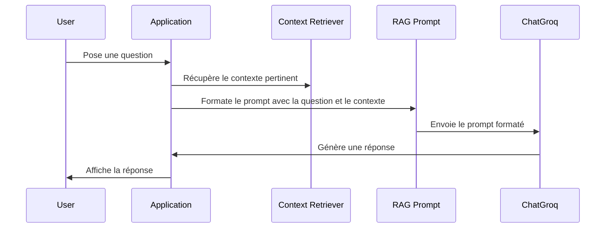

# Chapter 3: Prompt RAG

Dans le [Chapter 2: Modèle de langage (ChatGroq)](02_modèle_de_langage__chatgroq__.md), nous avons découvert comment ChatGroq utilise le modèle llama-3.3-70b-versatile pour comprendre et générer du texte. Mais comment lui donner les bonnes informations pour qu'il puisse répondre à nos questions le plus précisément possible ? C'est là qu'intervient le *Prompt RAG*.

Imaginez que vous demandez à un ami une information spécifique, comme "Comment puis-je améliorer mes compétences en programmation ?". Si votre ami n'a aucune idée de la programmation, sa réponse ne sera pas très utile. Mais si vous lui fournissez un contexte pertinent, comme "Je suis débutant en Python et je souhaite apprendre à créer des applications web", il pourra vous donner une réponse beaucoup plus précise et utile. Le Prompt RAG fait exactement la même chose pour notre chatbot !

Un Prompt RAG, ou Retrieval-Augmented Generation Prompt, est comme une *recette* que nous donnons à notre modèle de langage (ChatGroq). Cette recette lui dit comment utiliser les informations extraites (Retrieval) pour générer une réponse (Generation). C'est un mélange de notre question, d'informations contextuelles et d'instructions claires.

## Les concepts clés d'un Prompt RAG

Pour bien comprendre le Prompt RAG, décomposons-le en ses parties essentielles :

1.  **Question de l'utilisateur :** C'est la question ou la requête initiale que l'utilisateur pose au chatbot. C'est le point de départ de tout le processus. Par exemple : "Qu'est-ce que la formation assistée par l'IA ?".

2.  **Contexte extrait (Retrieval) :** Il s'agit des informations pertinentes extraites d'une source de données (comme notre base de données vectorielle).  C'est comme si on donnait à notre ami les manuels scolaires ou les articles de blog les plus pertinents pour répondre à notre question sur la programmation. Par exemple, des extraits de documents expliquant les avantages de la formation assistée par l'IA. Nous avons exploré ce processus de Retrieval dans le [Récupérateur de contexte contextuel (ContextualCompressionRetriever)](05_récupérateur_de_contexte_contextuel__contextualcompressionretriever__.md) et la [Base de données vectorielle (Chroma)](06_base_de_données_vectorielle__chroma__.md).

3.  **Historique de la conversation (Optionnel) :** Si nous avons déjà eu une conversation avec le chatbot, nous pouvons inclure un résumé de cette conversation dans le prompt. Cela permet au chatbot de se souvenir de ce dont nous avons déjà parlé et de donner des réponses plus cohérentes.  C'est comme si vous rappeliez à votre ami de quoi vous avez parlé lors de votre dernière conversation sur la programmation.  Nous explorerons plus en détail le [Mémoire de conversation (ConversationBufferMemory)](04_mémoire_de_conversation__conversationbuffermemory__.md).

4.  **Instructions (ou Rôle) :** Ce sont des instructions claires que nous donnons au modèle de langage sur la manière dont il doit utiliser les informations extraites et l'historique de la conversation pour générer une réponse.  Par exemple, nous pouvons lui dire de répondre de manière concise, d'utiliser un ton professionnel, ou de se concentrer sur les aspects pratiques. C'est comme si vous disiez à votre ami : "Réponds-moi de manière concise et donne-moi des exemples concrets".

## Comment utiliser un Prompt RAG dans notre chatbot

Dans notre code, le prompt RAG est défini dans la variable `rag_template` dans le fichier `chatbot.py` et `main.py`:

```python
rag_template = """\
Rôle :
Tu es un expert en formation et en formation assistée par l'IA.

Mission :
Aider l'utilisateur à comprendre et à utiliser efficacement une plateforme de formation basée sur l'IA, ainsi qu'à répondre à toute question générale sur la formation assistée par l'IA.

Historique :
{history}

Connaissances :
{context}

Question :
{question}

Consignes :

    Répondre uniquement en utilisant les informations disponibles et des donnés general selon la conversation.

    En cas de question hors sujet, répondre :
    _"Je n'ai pas cette information. Voici quelques questions sur lesquelles je peux vous aider :

    Comment créer une formation assistée par l'IA ?

    Comment l'IA améliore-t-elle les processus de formation ?

    Quels sont les avantages de l'apprentissage assistée par l'IA ?

    Quelles sont les meilleures pratiques pour intégrer l'IA dans la formation ?"_

    Adopter un ton professionnel, clair et précis.

Format attendu :
Réponse structurée avec des informations factuelles et bien organisées et adaptable sur la language de conversation.
"""
```

**Explication du code :**

*   `Rôle :`: Définit le rôle que le chatbot doit adopter.  Dans ce cas, il doit se comporter comme un expert en formation assistée par l'IA.
*   `Mission :`: Définie la mission du chatbot. Ici, il doit aider l'utilisateur à comprendre et à utiliser une plateforme de formation basée sur l'IA.
*   `Historique : {history}`:  Un espace réservé qui sera remplacé par l'historique de la conversation.
*   `Connaissances : {context}`: Un espace réservé qui sera remplacé par le contexte extrait.
*   `Question : {question}`: Un espace réservé qui sera remplacé par la question de l'utilisateur.
*   `Consignes :`: Donne des instructions spécifiques au chatbot. Dans ce cas, il doit répondre en utilisant uniquement les informations disponibles et adopter un ton professionnel.

Ce `rag_template` est ensuite utilisé pour créer un `ChatPromptTemplate`:

```python
from langchain.prompts import ChatPromptTemplate

rag_prompt = ChatPromptTemplate.from_template(rag_template)
```

**Explication du code :**

*   `rag_prompt = ChatPromptTemplate.from_template(rag_template)`: Crée un `ChatPromptTemplate` à partir du `rag_template`.  C'est comme transformer notre recette en un format que notre chatbot peut comprendre.

Enfin, dans la fonction `generate_response`, nous formatons le prompt avec les informations nécessaires :

```python
prompt = rag_prompt.format(
    history=conversation_history,
    context=context,
    question=user_message
)
```

**Explication du code :**

*   `prompt = rag_prompt.format(...)`: Remplace les espaces réservés `{history}`, `{context}` et `{question}` dans le `rag_template` par l'historique de la conversation, le contexte extrait et la question de l'utilisateur, respectivement. C'est comme si on remplissait les ingrédients de notre recette.

Par exemple, si l'utilisateur pose la question "Comment l'IA peut-elle améliorer la formation ?", et que le contexte extrait contient des informations sur la personnalisation de l'apprentissage grâce à l'IA, et que l'historique de la conversation est vide, alors le prompt formaté pourrait ressembler à ceci :

```
Rôle :
Tu es un expert en formation et en formation assistée par l'IA.

Mission :
Aider l'utilisateur à comprendre et à utiliser efficacement une plateforme de formation basée sur l'IA, ainsi qu'à répondre à toute question générale sur la formation assistée par l'IA.

Historique :


Connaissances :
- L'IA peut être utilisée pour personnaliser l'apprentissage en adaptant le contenu et le rythme de la formation aux besoins individuels des apprenants.

Question :
Comment l'IA peut-elle améliorer la formation ?

Consignes :

    Répondre uniquement en utilisant les informations disponibles et des donnés general selon la conversation.

    En cas de question hors sujet, répondre :
    _"Je n'ai pas cette information. Voici quelques questions sur lesquelles je peux vous aider :

    Comment créer une formation assistée par l'IA ?

    Comment l'IA améliore-t-elle les processus de formation ?

    Quels sont les avantages de l'apprentissage assistée par l'IA ?

    Quelles sont les meilleures pratiques pour intégrer l'IA dans la formation ?"_

    Adopter un ton professionnel, clair et précis.

Format attendu :
Réponse structurée avec des informations factuelles et bien organisées et adaptable sur la language de conversation.
```

Ce prompt formaté est ensuite envoyé à ChatGroq pour générer une réponse.

## Comment ça marche sous le capot

Voici un aperçu simplifié du fonctionnement interne du Prompt RAG :



En termes simples, l'application prend la question de l'utilisateur, récupère le contexte pertinent, formate un prompt en combinant la question et le contexte, envoie ce prompt à ChatGroq, et affiche la réponse générée à l'utilisateur.

Plus précisément, dans le code `chatbot.py` (ou `main.py`), cette séquence se déroule dans la fonction `generate_response` :

```python
def generate_response(user_message):
    conversation_history = memory.buffer
    context = retrieve_context(user_message)

    prompt = rag_prompt.format(
        history=conversation_history,
        context=context,
        question=user_message
    )

    response = llm_response([HumanMessage(content=prompt)]).content
    memory.save_context({"input": user_message}, {"output": response})
    return response
```

**Explication du code :**

1.  `conversation_history = memory.buffer`: Récupère l'historique de la conversation depuis la [Mémoire de conversation (ConversationBufferMemory)](04_mémoire_de_conversation__conversationbuffermemory__.md).
2.  `context = retrieve_context(user_message)`: Récupère le contexte pertinent depuis la [Base de données vectorielle (Chroma)](06_base_de_données_vectorielle__chroma__.md) en utilisant le [Récupérateur de contexte contextuel (ContextualCompressionRetriever)](05_récupérateur_de_contexte_contextuel__contextualcompressionretriever__.md).
3.  `prompt = rag_prompt.format(...)`: Formate le prompt en utilisant l'historique de la conversation, le contexte et la question de l'utilisateur.
4.  `response = llm_response([HumanMessage(content=prompt)]).content`: Envoie le prompt formaté à ChatGroq et récupère la réponse.
5.  `memory.save_context(...)`: Sauvegarde la question et la réponse dans la mémoire de conversation.
6.  `return response`: Renvoie la réponse générée.

## Liens vers d'autres abstractions

Le Prompt RAG est un élément crucial de notre chatbot, mais il fonctionne en collaboration avec d'autres abstractions clés. Il utilise le [Récupérateur de contexte contextuel (ContextualCompressionRetriever)](05_récupérateur_de_contexte_contextuel__contextualcompressionretriever__.md) pour obtenir les informations pertinentes, la [Mémoire de conversation (ConversationBufferMemory)](04_mémoire_de_conversation__conversationbuffermemory__.md) pour se souvenir des conversations précédentes et [Modèle de langage (ChatGroq)](02_modèle_de_langage__chatgroq__.md) pour générer la réponse finale. En combinant ces éléments, nous pouvons créer un chatbot plus intelligent et plus utile.

## Conclusion

Dans ce chapitre, nous avons exploré le concept de Prompt RAG et son rôle dans l'amélioration de la qualité des réponses de notre chatbot. Nous avons vu comment il combine la question de l'utilisateur, le contexte extrait et les instructions pour créer un prompt formaté qui est ensuite envoyé à ChatGroq. Dans le [Mémoire de conversation (ConversationBufferMemory)](04_mémoire_de_conversation__conversationbuffermemory__.md), nous allons plonger dans la manière dont nous permettons à notre chatbot de se souvenir des conversations précédentes pour une expérience plus personnalisée.


---

Generated by [AI Codebase Knowledge Builder](https://github.com/The-Pocket/Tutorial-Codebase-Knowledge)