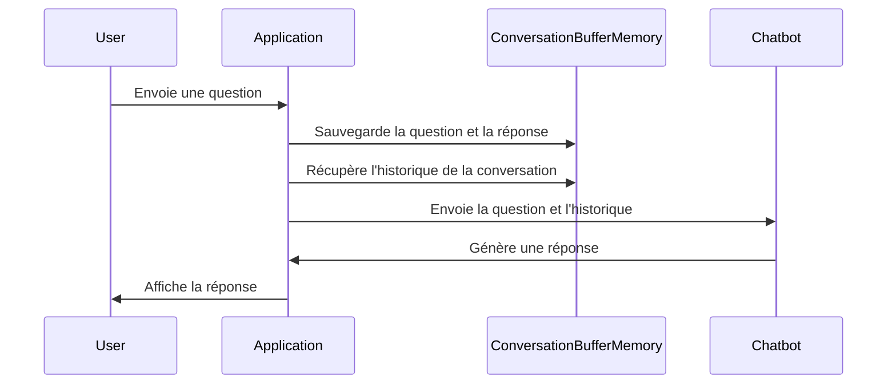

# Chapter 4: Mémoire de conversation (ConversationBufferMemory)

Dans le [Prompt RAG](03_prompt_rag_.md), nous avons vu comment formater une requête pour que notre chatbot puisse donner des réponses précises.  Mais que se passe-t-il si nous voulons avoir une véritable conversation avec le chatbot ?  C'est là que la mémoire de conversation entre en jeu.

Imaginez que vous parlez à un ami. Vous ne lui répétez pas le contexte de votre conversation à chaque phrase ! Votre ami se souvient de ce dont vous avez parlé auparavant. La `ConversationBufferMemory` permet à notre chatbot de faire la même chose : se souvenir des échanges précédents.

## Pourquoi avons-nous besoin d'une mémoire de conversation ?

Prenons un exemple simple. Vous demandez au chatbot : "Quels sont les avantages de la formation assistée par l'IA ?". Le chatbot vous donne une réponse. Ensuite, vous demandez : "Et quels sont les inconvénients ?". Sans mémoire, le chatbot aura oublié votre question précédente et devra à nouveau rechercher le contexte de la formation assistée par l'IA. Avec une mémoire, il se souvient que vous parlez toujours du même sujet et peut vous donner une réponse plus pertinente et plus rapide. C'est comme si vous disiez à votre ami : "Tu te souviens de ce dont on parlait avant ? Maintenant, parle-moi des inconvénients."

## Qu'est-ce que ConversationBufferMemory ?

`ConversationBufferMemory` est comme un bloc-notes numérique pour notre chatbot. Il enregistre chaque question que vous posez et chaque réponse qu'il vous donne.  Il stocke donc un historique des interactions.  Ensuite, lorsqu'il doit répondre à une nouvelle question, il peut consulter ce bloc-notes pour se rappeler ce dont vous avez déjà parlé.

Pensez à `ConversationBufferMemory` comme à une liste de toutes les questions et réponses dans la conversation.  Plus la liste est longue, plus le chatbot se souvient de la conversation.

## Utilisation de ConversationBufferMemory dans notre chatbot

Voici comment nous utilisons `ConversationBufferMemory` dans notre code :

```python
from langchain.memory import ConversationBufferMemory

memory = ConversationBufferMemory(memory_key="history", return_messages=False)
```

**Explication du code :**

*   `from langchain.memory import ConversationBufferMemory`: importe la classe `ConversationBufferMemory` de la bibliothèque `langchain`.
*   `memory = ConversationBufferMemory(...)`: Crée une instance de la classe `ConversationBufferMemory`.  On lui donne un nom (`memory_key="history"`) et on lui dit de ne pas renvoyer les messages sous forme d'objets `BaseMessage` ( `return_messages=False`).

Maintenant, pour sauvegarder la conversation après chaque interaction :

```python
memory.save_context({"input": user_message}, {"output": response})
```

**Explication du code :**

*   `memory.save_context(...)`: Sauvegarde la question de l'utilisateur (`user_message`) et la réponse du chatbot (`response`) dans la mémoire.  `{"input": user_message}` est le format standard pour les questions, et `{"output": response}` est le format standard pour les réponses.

Et pour récupérer l'historique de la conversation :

```python
conversation_history = memory.buffer
```

**Explication du code :**

*   `conversation_history = memory.buffer`: Récupère tout l'historique de la conversation sous forme de chaîne de caractères.  Cette chaîne contient toutes les questions et réponses précédentes, concaténées ensemble.

Par exemple, si l'utilisateur a posé les questions "Qu'est-ce que l'IA ?" et "Quels sont ses avantages ?", et que le chatbot a répondu à ces questions, alors `conversation_history` pourrait contenir quelque chose comme :

```
Human: Qu'est-ce que l'IA ?
AI: L'IA est...
Human: Quels sont ses avantages ?
AI: Ses avantages sont...
```

## Comment ça marche sous le capot

Voici un aperçu simplifié du fonctionnement interne de `ConversationBufferMemory` :



En termes simples, l'application prend la question de l'utilisateur et la sauvegarde dans la `ConversationBufferMemory`.  Ensuite, lorsqu'elle doit générer une réponse, elle récupère l'historique de la conversation de la `ConversationBufferMemory` et l'envoie au chatbot avec la question actuelle.  Cela permet au chatbot de se souvenir de ce dont vous avez déjà parlé.

Plus précisément, dans notre code, cette séquence se déroule dans la fonction `generate_response` du fichier `chatbot.py` (et `main.py`):

```python
def generate_response(user_message):
    conversation_history = memory.buffer
    context = retrieve_context(user_message)

    prompt = rag_prompt.format(
        history=conversation_history,
        context=context,
        question=user_message
    )

    response = llm_response([HumanMessage(content=prompt)]).content
    memory.save_context({"input": user_message}, {"output": response})
    return response
```

**Explication du code :**

1.  `conversation_history = memory.buffer`: Récupère l'historique de la conversation de la `ConversationBufferMemory`.
2.  `context = retrieve_context(user_message)`: Récupère le contexte pertinent de notre base de données de connaissances (nous verrons cela plus tard).
3.  `prompt = rag_prompt.format(...)`: Formate le prompt en utilisant l'historique de la conversation, le contexte et la question de l'utilisateur. C'est ici que l'historique de la conversation est injecté dans le prompt qui sera envoyé au [Modèle de langage (ChatGroq)](02_modèle_de_langage__chatgroq__.md).
4.  `response = llm_response([HumanMessage(content=prompt)]).content`: Envoie le prompt formaté au modèle de langage et récupère la réponse.
5.  `memory.save_context({"input": user_message}, {"output": response})`: Sauvegarde la question et la réponse dans la `ConversationBufferMemory`.
6.  `return response`: Renvoie la réponse générée.

## Liens vers d'autres abstractions

La `ConversationBufferMemory` travaille en étroite collaboration avec le [Prompt RAG](03_prompt_rag_.md) et le [Modèle de langage (ChatGroq)](02_modèle_de_langage__chatgroq__.md). Elle fournit l'historique de la conversation qui est utilisé par le Prompt RAG pour formater la question de l'utilisateur, et le modèle de langage utilise ce prompt formaté pour générer une réponse.  En combinant ces trois éléments, nous pouvons créer un chatbot qui se souvient des conversations précédentes et donne des réponses plus pertinentes.

## Conclusion

Dans ce chapitre, nous avons appris ce qu'est la `ConversationBufferMemory`, comment elle fonctionne et comment nous l'utilisons dans notre chatbot pour lui permettre de se souvenir des conversations précédentes.  Dans le [Récupérateur de contexte contextuel (ContextualCompressionRetriever)](05_récupérateur_de_contexte_contextuel__contextualcompressionretriever__.md), nous explorerons comment nous pouvons récupérer des informations pertinentes à partir d'une base de données de connaissances pour améliorer encore plus la qualité des réponses de notre chatbot.


---

Generated by [AI Codebase Knowledge Builder](https://github.com/The-Pocket/Tutorial-Codebase-Knowledge)