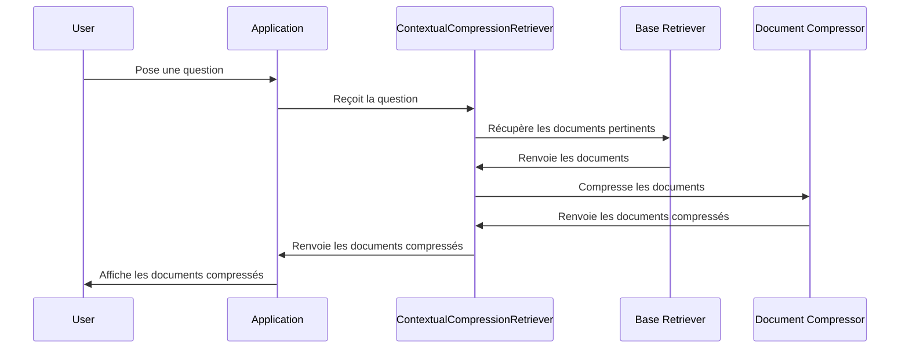

# Chapter 5: Récupérateur de contexte contextuel (ContextualCompressionRetriever)

Dans le [Mémoire de conversation (ConversationBufferMemory)](04_mémoire_de_conversation__conversationbuffermemory__.md), nous avons appris comment notre chatbot peut se souvenir des conversations précédentes. Mais comment s'assurer que le chatbot utilise les *informations les plus pertinentes* pour répondre à la question actuelle ? C'est là que le `ContextualCompressionRetriever` entre en jeu.

Imaginez que vous demandez à un ami : "Comment puis-je apprendre le Python ?". Votre ami a accès à une énorme bibliothèque de livres sur la programmation.  Il pourrait simplement vous donner *tous* les livres sur Python, mais ce serait beaucoup trop d'informations inutiles !  Au lieu de cela, il devrait parcourir rapidement tous les livres, trouver les *passages les plus pertinents* concernant votre question ("apprendre le Python"), et vous donner *seulement* ces passages.  Le `ContextualCompressionRetriever` fait exactement la même chose pour notre chatbot : il trouve les documents les plus pertinents et extrait les passages les plus importants. Il utilise un LLM (llama-3.3-70b-versatile) pour compresser le contexte.

## Pourquoi avons-nous besoin d'un `ContextualCompressionRetriever`?

L'objectif principal est de *réduire le bruit* et d'aider le chatbot à se concentrer sur les informations essentielles. Sans lui, le chatbot pourrait être submergé par des documents longs et compliqués, et il pourrait avoir du mal à trouver les réponses pertinentes. Un `ContextualCompressionRetriever` permet :

*   De réduire la taille du contexte envoyé au LLM, ce qui peut améliorer la vitesse et réduire les coûts.
*   D'améliorer la qualité des réponses en se concentrant sur les informations les plus importantes.
*   De gérer plus efficacement les grands volumes de données.

## Les concepts clés d'un `ContextualCompressionRetriever`

Décomposons ce composant en ses parties principales :

1.  **Récupérateur de base (Base Retriever):** C'est le composant initial qui extrait un ensemble de documents pertinents à partir d'une source de données (par exemple, une base de données vectorielle comme [Base de données vectorielle (Chroma)](06_base_de_données_vectorielle__chroma__.md)). Il retourne une liste de documents potentiellement pertinents. C'est comme si votre ami parcourait rapidement sa bibliothèque et sélectionnait quelques livres qui semblent traiter du Python.

2.  **Compresseur de documents (Document Compressor):** C'est le composant qui prend la liste des documents récupérés par le récupérateur de base et les *compresse*. La compression signifie ici identifier les passages les plus pertinents dans chaque document et supprimer le reste. Notre compresseur de document est basé sur un LLM et est implémenté en utilisant `LLMChainExtractor`. C'est comme si votre ami, après avoir sélectionné les livres, lisait rapidement chaque livre et ne gardait que les passages qui parlent directement de "comment apprendre le Python".

3.  **Combinaison :** Le `ContextualCompressionRetriever` combine ces deux composants pour fournir une liste de documents compressés qui sont à la fois pertinents et concis.

## Comment utiliser un `ContextualCompressionRetriever` dans notre chatbot

Voici un exemple de code simplifié illustrant comment le `ContextualCompressionRetriever` est configuré :

```python
from langchain.retrievers import ContextualCompressionRetriever
from langchain.retrievers.document_compressors import LLMChainExtractor

# Initialiser le compresseur LLM
compressor_llm = LLMChainExtractor.from_llm(llm)

# Initialiser le récupérateur contextuel
compression_retriever = ContextualCompressionRetriever(
    base_compressor=compressor_llm,
    base_retriever=base_retriever
)
```

**Explication du code :**

1.  `compressor_llm = LLMChainExtractor.from_llm(llm)`:  Crée un compresseur de documents en utilisant un LLM (`llm`). Ce compresseur utilisera le LLM pour identifier et extraire les passages les plus importants dans chaque document.
2.  `compression_retriever = ContextualCompressionRetriever(...)`:  Crée le `ContextualCompressionRetriever`, en lui fournissant le compresseur de documents et le récupérateur de base (`base_retriever`). Le `base_retriever` est un simple retriever qui va chercher les documents pertinents (on verra ça plus tard).

Pour obtenir les documents pertinents et compressés, vous pouvez utiliser la méthode `get_relevant_documents` :

```python
compressed_docs = compression_retriever.get_relevant_documents("Comment apprendre le Python ?")
print(compressed_docs)
```

**Explication du code :**

*   `compressed_docs = compression_retriever.get_relevant_documents("Comment apprendre le Python ?")`: Récupère les documents pertinents et compressés pour la question "Comment apprendre le Python ?". Le `compression_retriever` utilise d'abord le `base_retriever` pour trouver les documents pertinents, puis il utilise le `compressor_llm` pour extraire les passages les plus importants de ces documents.
*   `print(compressed_docs)`: Affiche les documents compressés. Vous verrez probablement une liste de passages courts et précis qui répondent directement à la question.

Par exemple, `compressed_docs` pourrait contenir :

```
[Document(page_content="Pour apprendre le Python, commencez par les bases de la syntaxe et des types de données.", metadata={...}), Document(page_content="Il existe de nombreuses ressources en ligne gratuites pour apprendre le Python.", metadata={...})]
```

## Comment ça marche sous le capot

Voici un aperçu simplifié du fonctionnement interne du `ContextualCompressionRetriever`:



En termes simples, l'application prend la question de l'utilisateur et l'envoie au `ContextualCompressionRetriever`. Celui-ci utilise d'abord le `Base Retriever` pour récupérer les documents pertinents, puis le `Document Compressor` pour compresser ces documents. Enfin, il renvoie les documents compressés à l'application, qui les affiche à l'utilisateur.

Dans notre code, la fonction `retrieve_context` dans `chatbot.py` utilise le `ContextualCompressionRetriever` :

```python
def retrieve_context(query):
    docs = advanced_retriever.get_relevant_documents(query)
    for doc in docs:
        print(doc.page_content)  # Affiche le contenu de chaque document
    return "\n\n".join([f"- {doc.page_content}" for doc in docs])
```

**Explication du code :**

1.  `docs = advanced_retriever.get_relevant_documents(query)`: Récupère les documents pertinents et compressés pour la requête donnée.  `advanced_retriever` est notre `ContextualCompressionRetriever` configuré.
2.   `for doc in docs:`:  Itère sur les documents compressés retournés par le retriever.
3.   `print(doc.page_content)`: Affiche le contenu compressé de chaque document.
4.  `return "\n\n".join([f"- {doc.page_content}" for doc in docs])`:  Formate les documents compressés en une seule chaîne de caractères, où chaque document est précédé d'un tiret ("- ") et séparé par deux sauts de ligne. Cette chaîne de caractères est ensuite utilisée dans le [Prompt RAG](03_prompt_rag_.md).

On peut voir dans la section `Initialize components` de `chatbot.py` que le `base_retriever` est créé à partir de notre [Base de données vectorielle (Chroma)](06_base_de_données_vectorielle__chroma__.md):

```python
vector_store = Chroma(...)
retriever = vector_store.as_retriever(search_kwargs={'k': num_results})

llm_compression = ChatGroq(...)
compressor_llm = LLMChainExtractor.from_llm(llm_compression)
advanced_retriever = ContextualCompressionRetriever(
    base_compressor=compressor_llm,
    base_retriever=retriever
)
```

## Liens vers d'autres abstractions

Le `ContextualCompressionRetriever` fonctionne en étroite collaboration avec d'autres abstractions :

*   Il s'appuie sur un [Base de données vectorielle (Chroma)](06_base_de_données_vectorielle__chroma__.md) pour stocker et récupérer les documents pertinents.
*   Il utilise un [Modèle de langage (ChatGroq)](02_modèle_de_langage__chatgroq__.md) pour compresser les documents et extraire les passages les plus importants.
*   Il fournit le contexte compressé qui est utilisé par le [Prompt RAG](03_prompt_rag_.md) pour formater la question de l'utilisateur et générer une réponse.

## Conclusion

Dans ce chapitre, nous avons appris ce qu'est un `ContextualCompressionRetriever`, comment il fonctionne et comment nous l'utilisons dans notre chatbot pour améliorer la qualité des réponses en se concentrant sur les informations les plus pertinentes. Nous avons vu comment il combine un récupérateur de base et un compresseur de documents pour extraire les passages les plus importants des documents pertinents. Dans le [Base de données vectorielle (Chroma)](06_base_de_données_vectorielle__chroma__.md), nous allons explorer comment nous pouvons stocker et rechercher efficacement des documents pour notre chatbot.


---

Generated by [AI Codebase Knowledge Builder](https://github.com/The-Pocket/Tutorial-Codebase-Knowledge)