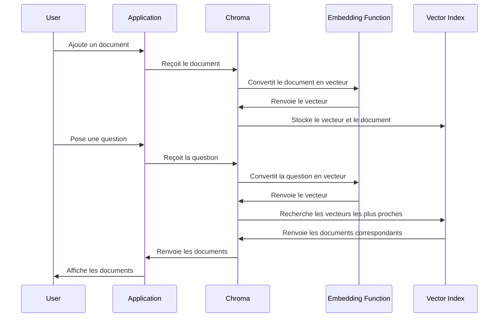

# Chapter 6: Base de données vectorielle (Chroma)

Dans le [Récupérateur de contexte contextuel (ContextualCompressionRetriever)](05_récupérateur_de_contexte_contextuel__contextualcompressionretriever__.md), nous avons appris à récupérer les informations les plus pertinentes pour répondre à une question.  Mais où stockons-nous toutes ces informations en premier lieu ? C'est là qu'une base de données vectorielle comme Chroma entre en jeu.

Imaginez que vous ayez une énorme collection d'articles de blog, de documents PDF et de pages web sur la formation assistée par l'IA.  Chaque fois que quelqu'un pose une question, vous ne pouvez pas parcourir *tous* ces documents à la recherche d'une réponse, cela prendrait une éternité ! Vous avez besoin d'un moyen d'organiser ces documents de manière à pouvoir trouver rapidement ceux qui sont pertinents pour une question donnée. Chroma est comme une bibliothèque super efficace pour les documents de notre chatbot. Au lieu de classer les livres par ordre alphabétique, elle les classe par *sujet* (plus précisément, par leur représentation vectorielle), ce qui nous permet de trouver rapidement les informations dont nous avons besoin.

## Pourquoi avons-nous besoin d'une base de données vectorielle ?

L'objectif principal d'une base de données vectorielle est de *stocker et de rechercher des documents de manière efficace*.  Sans elle, notre chatbot serait incapable de trouver rapidement les informations dont il a besoin pour répondre aux questions des utilisateurs. Les bases de données vectorielles permettent :

*   De stocker de grandes quantités de données textuelles de manière organisée.
*   De rechercher rapidement des documents similaires à une requête donnée.
*   D'améliorer la qualité des réponses du chatbot en lui fournissant les informations les plus pertinentes.

## Qu'est-ce qu'une base de données vectorielle ?

Une base de données vectorielle, comme Chroma, est spécialement conçue pour stocker des données sous forme de *vecteurs*. Mais qu'est-ce qu'un vecteur ?

Imaginez que chaque document (par exemple, un extrait de texte sur l'IA) soit représenté par une liste de nombres. Cette liste de nombres est un *vecteur*. Chaque nombre dans le vecteur représente une caractéristique du document. Par exemple, un nombre pourrait représenter la fréquence du mot "IA", un autre pourrait représenter la fréquence du mot "formation", etc. La valeur de ce vecteur est ce qu'on appelle *embedding*.

**Comment cela aide-t-il à la recherche ?**

Les documents qui sont *similaires* auront des vecteurs *proches* les uns des autres. Ainsi, pour trouver les documents les plus pertinents pour une question, nous convertissons la question en un vecteur, puis nous recherchons les vecteurs dans la base de données qui sont les plus proches du vecteur de la question.  C'est comme si vous demandiez à la bibliothèque : "Montrez-moi les livres qui ressemblent le plus à ceci".

Pensez à une carte. Chaque ville a des coordonnées (latitude et longitude). Deux villes proches sur la carte auront des coordonnées similaires. De même, dans une base de données vectorielle, deux documents similaires auront des vecteurs similaires.

## Utilisation de Chroma dans notre chatbot

Voici comment nous utilisons Chroma dans notre code :

```python
from langchain_chroma import Chroma
from langchain_ollama import OllamaEmbeddings

embeddings = OllamaEmbeddings(model="nomic-embed-text")
vector_store = Chroma(
    collection_name="chatbot",
    embedding_function=embeddings,
    persist_directory="chroma_db",
)
```

**Explication du code :**

1.  `from langchain_chroma import Chroma`: importe la classe `Chroma` de la bibliothèque `langchain-chroma`. `langchain-chroma` est une bibliothèque qui nous permet d'interagir facilement avec Chroma.
2.  `from langchain_ollama import OllamaEmbeddings`: importe la classe `OllamaEmbeddings` de la bibliothèque `langchain-ollama`. On l'utilise pour générer des vecteurs (embeddings) à partir de notre texte.
3.  `embeddings = OllamaEmbeddings(model="nomic-embed-text")`: Crée une instance de `OllamaEmbeddings`. Ici, nous utilisons le modèle "nomic-embed-text" pour créer les vecteurs.
4.  `vector_store = Chroma(...)`: Crée une instance de la classe `Chroma`. Cela crée une base de données vectorielle Chroma.  Nous spécifions le nom de la collection ("chatbot"), la fonction d'embedding à utiliser (`embeddings`) et le répertoire où stocker la base de données ("chroma_db").

Pour ajouter des documents à la base de données :

```python
from langchain_community.document_loaders import PyPDFDirectoryLoader
from langchain_text_splitters import RecursiveCharacterTextSplitter

loader = PyPDFDirectoryLoader("data")
raw_documents = loader.load()

text_splitter = RecursiveCharacterTextSplitter(chunk_size=1000, chunk_overlap=200)
chunks = text_splitter.split_documents(raw_documents)

vector_store.add_documents(documents=chunks)
```

**Explication du code :**

1.  `loader = PyPDFDirectoryLoader("data")`: Charge les documents à partir d'un répertoire. [Chargement et découpage de documents (PyPDFDirectoryLoader, RecursiveCharacterTextSplitter)](07_chargement_et_découpage_de_documents__pypdfdirectoryloader__recursivecharactertextsplitter__.md) explique cela plus en détail.
2.  `raw_documents = loader.load()`: Charge réellement les documents dans une liste d'objets `Document`.
3.  `text_splitter = RecursiveCharacterTextSplitter(...)`: Initialise un splitter de texte pour découper les longs documents en morceaux plus petits (chunks). Ceci est important car les modèles de langage ont une limite de taille sur l'entrée.
4.  `chunks = text_splitter.split_documents(raw_documents)`: Découpe les documents en morceaux.
5.  `vector_store.add_documents(documents=chunks)`: Ajoute les morceaux (chunks) à la base de données vectorielle. Pour chaque chunk, un vecteur est généré en utilisant la fonction `embeddings` que nous avons spécifiée lors de la création de `vector_store`, et ce vecteur est stocké avec le chunk dans la base de données.

Pour rechercher des documents similaires à une question :

```python
results = vector_store.similarity_search("Qu'est-ce que l'IA ?", k=3)
print(results)
```

**Explication du code :**

1.  `results = vector_store.similarity_search("Qu'est-ce que l'IA ?", k=3)`: Recherche les 3 documents les plus similaires à la question "Qu'est-ce que l'IA ?". La question est convertie en un vecteur en utilisant la même fonction d'embedding que celle utilisée pour stocker les documents, et ce vecteur est utilisé pour rechercher les vecteurs les plus proches dans la base de données.
2.  `print(results)`: Affiche les documents trouvés. Vous verrez probablement une liste de documents qui parlent de l'IA.

Par exemple, `results` pourrait contenir :

```
[Document(page_content="L'IA est un domaine de l'informatique qui se concentre sur la création de machines intelligentes.", metadata={...}), Document(page_content="L'IA peut être utilisée pour résoudre des problèmes complexes.", metadata={...}), Document(page_content="Il existe différents types d'IA, tels que l'IA faible et l'IA forte.", metadata={...})]
```

## Comment ça marche sous le capot

Voici un aperçu simplifié du fonctionnement interne de Chroma :



En termes simples, lorsque nous ajoutons un document à Chroma, il est converti en un vecteur et stocké dans un index vectoriel. Lorsque nous posons une question, elle est également convertie en un vecteur, et Chroma recherche les vecteurs les plus proches dans l'index vectoriel pour trouver les documents les plus pertinents.

Dans notre code, le fichier `chatbot.py` utilise Chroma pour créer le `retriever` :

```python
embeddings = OllamaEmbeddings(model="nomic-embed-text")
vector_store = Chroma(
    collection_name="chatbot",
    embedding_function=embeddings,
    persist_directory=CHROMA_PATH,
)

# Set up retriever and compression
num_results = 10
retriever = vector_store.as_retriever(search_kwargs={'k': num_results})
```

Ici, `vector_store` est notre base de données Chroma, et `retriever` est un objet qui nous permet de rechercher des documents dans la base de données.  La fonction `as_retriever()` de Chroma crée un objet retriever que l'on peut utiliser pour la recherche. `search_kwargs={'k': num_results}` indique que nous voulons récupérer les `num_results` documents les plus pertinents.

## Liens vers d'autres abstractions

Chroma est une pièce maîtresse dans notre système RAG, travaillant de concert avec d'autres abstractions :

*   Les [Intégrations de texte (Ollama Embeddings)](08_intégrations_de_texte__ollama_embeddings__.md) sont utilisées pour convertir le texte en vecteurs que Chroma peut stocker et rechercher.
*   Le [Récupérateur de contexte contextuel (ContextualCompressionRetriever)](05_récupérateur_de_contexte_contextuel__contextualcompressionretriever__.md) utilise Chroma pour récupérer les documents pertinents, puis compresse ces documents pour se concentrer sur les informations les plus importantes.
*   Ces informations sont ensuite utilisées par le [Prompt RAG](03_prompt_rag_.md) et le [Modèle de langage (ChatGroq)](02_modèle_de_langage__chatgroq__.md) pour générer une réponse à la question de l'utilisateur.

## Conclusion

Dans ce chapitre, nous avons appris ce qu'est une base de données vectorielle, comment elle fonctionne et comment nous l'utilisons dans notre chatbot pour stocker et rechercher efficacement des documents. Nous avons vu comment Chroma nous permet de trouver rapidement les informations dont nous avons besoin pour répondre aux questions des utilisateurs. Dans le [Chargement et découpage de documents (PyPDFDirectoryLoader, RecursiveCharacterTextSplitter)](07_chargement_et_découpage_de_documents__pypdfdirectoryloader__recursivecharactertextsplitter__.md), nous explorerons comment nous pouvons charger et préparer des documents pour les stocker dans Chroma.


---

Generated by [AI Codebase Knowledge Builder](https://github.com/The-Pocket/Tutorial-Codebase-Knowledge)