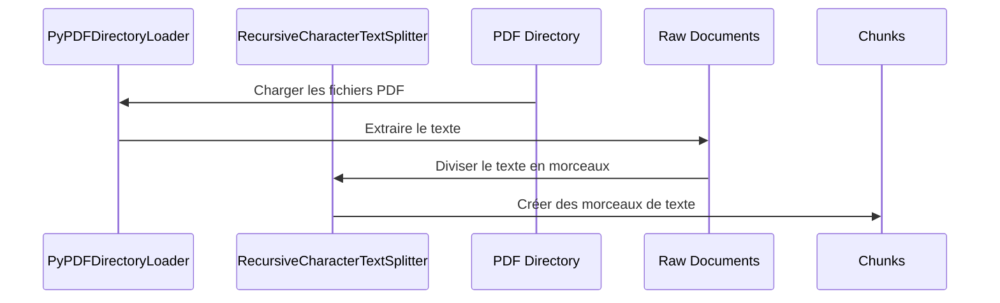

# Chapter 7: Chargement et découpage de documents (PyPDFDirectoryLoader, RecursiveCharacterTextSplitter)

Dans le [Base de données vectorielle (Chroma)](06_base_de_données_vectorielle__chroma__.md), nous avons vu comment stocker et organiser efficacement des informations pour notre chatbot. Mais avant de pouvoir stocker ces informations, nous devons d'abord les *charger* à partir de nos documents (comme des fichiers PDF) et les *découper* en petits morceaux gérables. C'est comme préparer les ingrédients avant de cuisiner !

Imaginez que vous ayez un long livre que vous voulez utiliser comme source d'informations pour votre chatbot. Vous ne pouvez pas simplement donner tout le livre au chatbot, car il serait submergé. Vous devez d'abord *extraire* le texte du livre, puis le *découper* en chapitres ou sections plus petits.  `PyPDFDirectoryLoader` et `RecursiveCharacterTextSplitter` sont les outils qui nous aident à faire exactement cela.

## Pourquoi avons-nous besoin de charger et de découper des documents ?

Le problème que ces outils résolvent est simple : les modèles de langage (comme celui utilisé dans [Modèle de langage (ChatGroq)](02_modèle_de_langage__chatgroq__.md)) ont une limite de taille sur la quantité de texte qu'ils peuvent traiter en même temps. De plus, il est plus efficace de rechercher des informations dans de petits morceaux de texte que dans de longs documents. Donc, pour que notre chatbot puisse utiliser efficacement des informations provenant de documents, nous devons :

1.  **Charger les documents :** Extraire le texte des fichiers (comme des PDF).
2.  **Découper les documents :** Diviser le texte extrait en morceaux plus petits, appelés "chunks".

## Les concepts clés

Décomposons les outils que nous allons utiliser :

1.  **`PyPDFDirectoryLoader`:** Cet outil est comme un aspirateur pour les fichiers PDF. Il prend un dossier en entrée et extrait tout le texte de tous les fichiers PDF qu'il contient. Il est comme un lecteur de livre qui lit chaque page et prend des notes.

2.  **`RecursiveCharacterTextSplitter`:** Cet outil est comme un couteau de cuisine pour le texte. Il prend un long morceau de texte et le découpe en morceaux plus petits, en essayant de respecter la structure du texte (par exemple, en ne coupant pas les phrases en deux).  C'est comme découper un gâteau en parts égales.

## Comment utiliser `PyPDFDirectoryLoader` et `RecursiveCharacterTextSplitter`

Voici comment nous pouvons les utiliser dans notre code :

```python
from langchain_community.document_loaders import PyPDFDirectoryLoader

loader = PyPDFDirectoryLoader("data")
raw_documents = loader.load()
```

**Explication du code :**

*   `from langchain_community.document_loaders import PyPDFDirectoryLoader`: importe la classe `PyPDFDirectoryLoader` de la bibliothèque `langchain`.
*   `loader = PyPDFDirectoryLoader("data")`: Crée une instance de `PyPDFDirectoryLoader` et spécifie le dossier "data" comme source des fichiers PDF.  Assurez-vous d'avoir un dossier appelé "data" avec des fichiers PDF dedans !
*   `raw_documents = loader.load()`: Charge tous les fichiers PDF du dossier "data" et extrait leur contenu textuel. `raw_documents` est maintenant une liste d'objets `Document`, où chaque `Document` contient le texte d'un fichier PDF.

Maintenant, découpons ces documents en morceaux plus petits :

```python
from langchain_text_splitters import RecursiveCharacterTextSplitter

text_splitter = RecursiveCharacterTextSplitter(chunk_size=1000, chunk_overlap=200)
chunks = text_splitter.split_documents(raw_documents)
```

**Explication du code :**

*   `from langchain_text_splitters import RecursiveCharacterTextSplitter`: importe la classe `RecursiveCharacterTextSplitter` de la bibliothèque `langchain`.
*   `text_splitter = RecursiveCharacterTextSplitter(chunk_size=1000, chunk_overlap=200)`: Crée une instance de `RecursiveCharacterTextSplitter` et spécifie deux paramètres :
    *   `chunk_size=1000`: La taille maximale de chaque morceau de texte (en caractères).  C'est comme dire "chaque part de gâteau doit avoir une taille maximale de 1000 grammes".
    *   `chunk_overlap=200`: Le nombre de caractères qui se chevauchent entre deux morceaux de texte consécutifs. Cela permet de s'assurer qu'aucune information n'est perdue lors de la découpe. C'est comme dire "laissons un peu de gâteau sur chaque part pour que les gens sachent que les parts sont connectées".
*   `chunks = text_splitter.split_documents(raw_documents)`: Découpe les documents en morceaux. `chunks` est maintenant une liste d'objets `Document`, où chaque `Document` contient un morceau de texte de taille maximale 1000 caractères.

Nous avons maintenant une liste de "chunks", qui sont des morceaux de texte plus petits et plus faciles à gérer pour notre chatbot. On peut maintenant ajouter ces "chunks" à notre [Base de données vectorielle (Chroma)](06_base_de_données_vectorielle__chroma__.md)!

## Comment ça marche sous le capot

Voici un aperçu simplifié du fonctionnement interne de `PyPDFDirectoryLoader` et `RecursiveCharacterTextSplitter`:



En termes simples, `PyPDFDirectoryLoader` lit les fichiers PDF et extrait le texte. Ensuite, `RecursiveCharacterTextSplitter` prend ce texte et le divise en morceaux plus petits.

Regardons maintenant le code dans `seed_db.py` pour voir comment ces outils sont utilisés dans notre projet :

```python
from langchain_community.document_loaders import PyPDFDirectoryLoader
from langchain_text_splitters import RecursiveCharacterTextSplitter

loader = PyPDFDirectoryLoader(DATA_PATH)
raw_documents = loader.load()

text_splitter = RecursiveCharacterTextSplitter(
    chunk_size=1000,
    chunk_overlap=200,
    length_function=len,
    is_separator_regex=False,
)
chunks = text_splitter.split_documents(raw_documents)
```

**Explication du code :**

Ce code est similaire à l'exemple que nous avons vu précédemment. Il charge les fichiers PDF du dossier `DATA_PATH` et les divise en morceaux. Les morceaux sont ensuite ajoutés à la [Base de données vectorielle (Chroma)](06_base_de_données_vectorielle__chroma__.md) dans la même fonction.

## Liens vers d'autres abstractions

`PyPDFDirectoryLoader` et `RecursiveCharacterTextSplitter` sont des outils de base qui préparent les données pour les autres abstractions :

*   Les morceaux de texte créés par `RecursiveCharacterTextSplitter` sont ensuite utilisés pour créer des vecteurs (embeddings) par les [Intégrations de texte (Ollama Embeddings)](08_intégrations_de_texte__ollama_embeddings__.md).
*   Ces vecteurs sont ensuite stockés dans la [Base de données vectorielle (Chroma)](06_base_de_données_vectorielle__chroma__.md).
*   Le [Récupérateur de contexte contextuel (ContextualCompressionRetriever)](05_récupérateur_de_contexte_contextuel__contextualcompressionretriever__.md) utilise ensuite Chroma pour récupérer les morceaux de texte les plus pertinents pour une question donnée.
*   Ces morceaux de texte sont ensuite utilisés par le [Prompt RAG](03_prompt_rag_.md) et le [Modèle de langage (ChatGroq)](02_modèle_de_langage__chatgroq__.md) pour générer une réponse à la question de l'utilisateur.

## Conclusion

Dans ce chapitre, nous avons appris comment charger des documents PDF et les diviser en morceaux plus petits à l'aide de `PyPDFDirectoryLoader` et `RecursiveCharacterTextSplitter`. Nous avons vu comment ces outils préparent les données pour les autres abstractions de notre chatbot. Dans le [Intégrations de texte (Ollama Embeddings)](08_intégrations_de_texte__ollama_embeddings__.md), nous allons explorer comment créer des vecteurs (embeddings) à partir de ces morceaux de texte.


---

Generated by [AI Codebase Knowledge Builder](https://github.com/The-Pocket/Tutorial-Codebase-Knowledge)