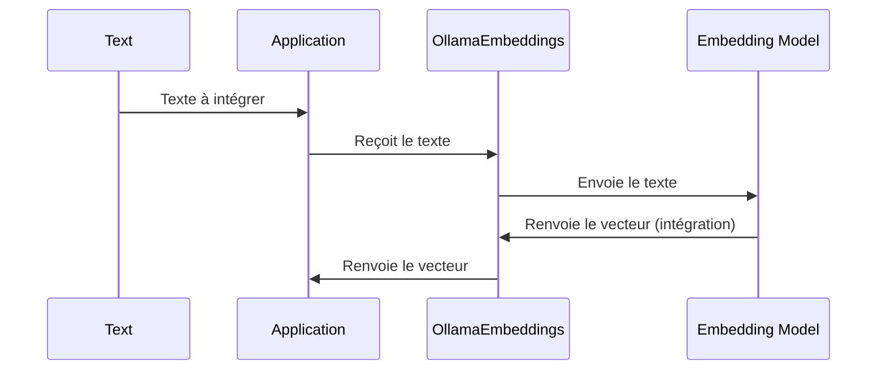

# Chapter 8: Intégrations de texte (Ollama Embeddings)

Dans le [Base de données vectorielle (Chroma)](06_base_de_données_vectorielle__chroma__.md), nous avons appris comment stocker et rechercher des documents efficacement. Mais comment transformer du texte brut en quelque chose qu'une base de données vectorielle peut comprendre ? C'est là qu'interviennent les **intégrations de texte** !

Imaginez que vous voulez comparer deux phrases : "Le ciel est bleu" et "L'océan est bleu". Un ordinateur ne voit que des suites de caractères. Comment savoir que ces phrases sont *similaires* parce qu'elles parlent toutes les deux de quelque chose de bleu ? Les intégrations de texte nous aident à faire cela. Elles transforment chaque phrase en une liste de nombres (un vecteur) qui représente le *sens* de la phrase. Les phrases similaires auront des vecteurs similaires. Ollama Embeddings est une façon de créer ces vecteurs.

## Pourquoi avons-nous besoin d'intégrations de texte ?

L'objectif principal est de transformer du texte en une représentation numérique qui peut être utilisée pour la recherche de similarités, le clustering, et d'autres tâches de traitement du langage naturel. Sans intégrations de texte, notre chatbot ne pourrait pas comprendre le sens des questions des utilisateurs et ne pourrait pas trouver les documents les plus pertinents. Les intégrations de texte permettent :

*   De représenter le sens du texte sous forme numérique.
*   De comparer facilement la similarité entre différents textes.
*   D'améliorer la précision de la recherche de documents pertinents.

## Qu'est-ce qu'une intégration de texte ?

Une intégration de texte (ou "embedding" en anglais) est une représentation vectorielle d'un morceau de texte. Pensez-y comme à une empreinte digitale unique pour chaque phrase ou document. Cette empreinte digitale capture le sens du texte et permet de le comparer à d'autres textes.

**Analogie avec une carte :**

Imaginez une carte du monde. Chaque ville a des coordonnées (latitude et longitude). Les villes proches sur la carte ont des coordonnées similaires. De même, les textes similaires auront des vecteurs (intégrations) proches les uns des autres dans l'espace vectoriel.

**Ollama Embeddings :**

Ollama Embeddings est une méthode spécifique pour créer ces vecteurs à partir du texte. Il utilise un modèle de langage (un peu comme celui que nous avons vu dans le [Modèle de langage (ChatGroq)](02_modèle_de_langage__chatgroq__.md)) pour analyser le texte et générer le vecteur correspondant.

## Comment utiliser Ollama Embeddings

Voici comment nous utilisons Ollama Embeddings dans notre code :

```python
from langchain_ollama import OllamaEmbeddings

embeddings = OllamaEmbeddings(model="nomic-embed-text")
```

**Explication du code :**

1.  `from langchain_ollama import OllamaEmbeddings`: importe la classe `OllamaEmbeddings` de la bibliothèque `langchain-ollama`.
2.  `embeddings = OllamaEmbeddings(model="nomic-embed-text")`: Crée une instance de `OllamaEmbeddings` et spécifie le modèle à utiliser ("nomic-embed-text"). Ce modèle est pré-entraîné pour générer de bonnes intégrations de texte.

Maintenant, pour créer une intégration pour une phrase :

```python
text = "La formation assistée par l'IA est l'avenir de l'éducation."
vector = embeddings.embed_query(text)
print(len(vector)) # Exemple de sortie: 768
```

**Explication du code :**

1.  `text = "La formation assistée par l'IA est l'avenir de l'éducation."`: Définie la phrase pour laquelle nous voulons créer une intégration.
2.  `vector = embeddings.embed_query(text)`:  Appelle la méthode `embed_query` de l'objet `embeddings` pour créer l'intégration. Le modèle "nomic-embed-text" analyse la phrase et génère un vecteur de 768 nombres qui représente le sens de la phrase.
3.  `print(len(vector))`: Affiche la longueur du vecteur. Dans ce cas, le vecteur a une longueur de 768, ce qui signifie qu'il est composé de 768 nombres. Chaque nombre représente une caractéristique du sens de la phrase.

Ce vecteur peut ensuite être stocké dans une [Base de données vectorielle (Chroma)](06_base_de_données_vectorielle__chroma__.md) et utilisé pour la recherche de similarités.

## Comment ça marche sous le capot

Voici un aperçu simplifié du fonctionnement interne d'Ollama Embeddings :



En termes simples, l'application prend le texte, l'envoie à OllamaEmbeddings, qui utilise un modèle d'embedding (ici "nomic-embed-text") pour générer un vecteur représentant le sens du texte. Ce vecteur est ensuite renvoyé à l'application.

Dans notre code, le fichier `chatbot.py` utilise Ollama Embeddings pour créer les vecteurs qui seront stockés dans Chroma :

```python
from langchain_ollama import OllamaEmbeddings

embeddings = OllamaEmbeddings(model="nomic-embed-text")
```

Ce code initialise l'objet `embeddings` qui sera utilisé pour créer les vecteurs pour tous les documents que nous ajoutons à la base de données. Ces vecteurs sont ensuite utilisés par Chroma pour la recherche de similarités.

## Liens vers d'autres abstractions

Ollama Embeddings est un composant essentiel de notre système RAG, travaillant en collaboration avec d'autres abstractions :

*   Il est utilisé par le [Base de données vectorielle (Chroma)](06_base_de_données_vectorielle__chroma__.md) pour créer les vecteurs qui sont stockés dans la base de données.
*   Le [Récupérateur de contexte contextuel (ContextualCompressionRetriever)](05_récupérateur_de_contexte_contextuel__contextualcompressionretriever__.md) utilise les vecteurs créés par Ollama Embeddings pour trouver les documents les plus pertinents pour une question donnée.
*   Ces documents sont ensuite utilisés par le [Prompt RAG](03_prompt_rag_.md) et le [Modèle de langage (ChatGroq)](02_modèle_de_langage__chatgroq__.md) pour générer une réponse à la question de l'utilisateur.

## Conclusion

Dans ce chapitre, nous avons appris ce que sont les intégrations de texte, comment elles fonctionnent et comment nous utilisons Ollama Embeddings pour créer ces intégrations à partir de texte. Nous avons vu comment ces intégrations sont utilisées pour représenter le sens du texte et comment elles permettent de comparer la similarité entre différents textes. Dans le [API FastAPI](09_api_fastapi_.md), nous allons explorer comment créer une API pour notre chatbot.


---

Generated by [AI Codebase Knowledge Builder](https://github.com/The-Pocket/Tutorial-Codebase-Knowledge)