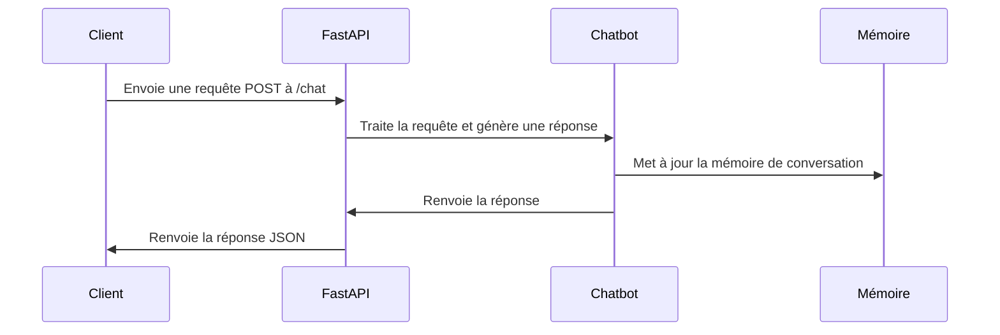

# Chapter 9: API FastAPI

Dans le [Intégrations de texte (Ollama Embeddings)](08_intégrations_de_texte__ollama_embeddings__.md), nous avons appris à transformer du texte en vecteurs pour la recherche de similarités. Maintenant, comment rendre notre chatbot accessible à d'autres applications ou utilisateurs via le web ? C'est là qu'une API FastAPI entre en jeu!

Imaginez que vous avez créé un délicieux gâteau. Au lieu de le garder pour vous, vous voulez permettre à vos amis d'en profiter. Vous ouvrez donc une pâtisserie. L'API FastAPI est comme cette pâtisserie : elle offre un moyen structuré et facile pour d'autres applications d'accéder aux capacités de votre chatbot.

## Pourquoi avons-nous besoin d'une API FastAPI ?

L'objectif principal est de rendre notre chatbot accessible via une interface web standardisée. Sans API, il faudrait exécuter le chatbot directement dans un environnement Python. Une API permet :

*   D'intégrer le chatbot dans d'autres applications web ou mobiles.
*   De permettre à plusieurs utilisateurs d'accéder au chatbot simultanément.
*   De simplifier l'utilisation du chatbot sans nécessiter de connaissances en programmation Python.

## Qu'est-ce qu'une API FastAPI ?

Une API (Application Programming Interface) est un ensemble de règles et de spécifications que les logiciels peuvent suivre pour communiquer entre eux. FastAPI est un framework Python moderne et rapide pour construire des APIs. Pensez-y comme à un serveur web léger qui écoute les demandes et renvoie les réponses.

**Analogie avec un restaurant :**

Vous, en tant que client, envoyez une "demande" (votre commande) au restaurant (API). Le restaurant traite votre demande, prépare votre plat (réponse du chatbot) et vous le renvoie.

**Concepts clés de FastAPI:**

1.  **Endpoints:** Les URLs spécifiques que l'API écoute. Par exemple, `/chat` pour recevoir les questions et renvoyer les réponses.
2.  **Requêtes:** Les données envoyées à l'API (par exemple, la question de l'utilisateur).
3.  **Réponses:** Les données renvoyées par l'API (par exemple, la réponse du chatbot).
4.  **Méthodes HTTP:** Les types d'actions que l'on peut effectuer sur un endpoint (par exemple, `POST` pour envoyer une requête, `GET` pour obtenir des informations).

## Comment utiliser l'API FastAPI de notre chatbot

Voici un exemple simplifié de la façon dont on utilise l'API :

On a un endpoint `/chat` qui prend une requête (la question) et renvoie une réponse (la réponse du chatbot).

**1. Envoyer une requête (POST) à /chat**

Imaginons qu'on envoie une requête avec le message "Qu'est-ce que l'IA ?".

**2. L'API traite la requête**

FastAPI prend cette requête, l'envoie à notre chatbot (qui utilise le [Modèle de langage (ChatGroq)](02_modèle_de_langage__chatgroq__.md), [Prompt RAG](03_prompt_rag_.md), etc.), et obtient une réponse.

**3. L'API renvoie la réponse (JSON)**

FastAPI renvoie une réponse au format JSON (un format de données standard pour le web) :

```json
{
  "response": "L'IA est un domaine de l'informatique qui se concentre sur la création de machines intelligentes."
}
```

## Code Exemple

Voici un aperçu du code FastAPI (tiré du fichier `main.py`) :

```python
from fastapi import FastAPI, HTTPException
from pydantic import BaseModel

app = FastAPI(title="AI Training Chatbot API")

class ChatRequest(BaseModel):
    message: str
    session_id: str | None = None

class ChatResponse(BaseModel):
    response: str

@app.post("/chat", response_model=ChatResponse)
def chat(req: ChatRequest):
    # ... (le code du chatbot pour générer une réponse) ...
    return ChatResponse(response=answer)
```

**Explication du code :**

1.  `from fastapi import FastAPI, HTTPException`: importe les classes `FastAPI` et `HTTPException` de la bibliothèque `fastapi`.
2.  `from pydantic import BaseModel`: importe la classe `BaseModel` de la bibliothèque `pydantic`.
3.  `app = FastAPI(title="AI Training Chatbot API")`: crée une instance de la classe `FastAPI`. C'est notre application FastAPI.
4.  `class ChatRequest(BaseModel):`:  Définit une classe `ChatRequest` qui hérite de `BaseModel`. Cette classe définit la structure de la requête que nous attendons pour l'endpoint `/chat`. Elle contient un champ `message` (la question) et un champ optionnel `session_id`.
5.  `class ChatResponse(BaseModel):`: Définit une classe `ChatResponse` qui hérite de `BaseModel`. Cette classe définit la structure de la réponse que nous renvoyons pour l'endpoint `/chat`. Elle contient un champ `response` (la réponse du chatbot).
6.  `@app.post("/chat", response_model=ChatResponse)`: Décore la fonction `chat` avec `@app.post("/chat")`. Cela signifie que cette fonction sera appelée lorsqu'une requête `POST` est envoyée à l'URL `/chat`. `response_model=ChatResponse` spécifie que cette fonction renverra une réponse au format `ChatResponse`.
7.  `def chat(req: ChatRequest):`: Définit la fonction `chat`. Cette fonction prend un argument `req` de type `ChatRequest`, qui contient la question de l'utilisateur.  Le code à l'intérieur de cette fonction utilise tous les composants que nous avons vus dans les chapitres précédents ( [Mémoire de conversation (ConversationBufferMemory)](04_mémoire_de_conversation__conversationbuffermemory__.md), [Récupérateur de contexte contextuel (ContextualCompressionRetriever)](05_récupérateur_de_contexte_contextuel__contextualcompressionretriever__.md), etc.) pour générer une réponse.
8.  `return ChatResponse(response=answer)`:  Renvoie la réponse du chatbot au format `ChatResponse`.

Il y a aussi un endpoint `/reset` pour réinitialiser la mémoire de la conversation.

## Comment ça marche sous le capot

Voici un aperçu simplifié du fonctionnement interne de l'API FastAPI :



En termes simples, le client envoie une requête à l'API FastAPI. FastAPI traite la requête en utilisant le chatbot, met à jour la mémoire de conversation et renvoie la réponse au client.

Plus précisément, voici le code dans la fonction `chat` (du fichier `main.py`):

```python
@app.post("/chat", response_model=ChatResponse)
def chat(req: ChatRequest):
    sid = req.session_id or "default"
    memory = get_memory(sid)
    history = memory.buffer

    context = retrieve_context(req.message)
    prompt_text = rag_prompt.format(
        history=history,
        context=context,
        question=req.message
    )
    try:
        res = llm_response([HumanMessage(content=prompt_text)])
        answer = res.content
    except Exception as e:
        raise HTTPException(status_code=500, detail=str(e))

    memory.save_context({"input": req.message}, {"output": answer})
    return ChatResponse(response=answer)
```

**Explication du code :**

1.  `sid = req.session_id or "default"`: Récupère l'ID de session de la requête. Si aucun ID de session n'est fourni, utilise "default" comme ID de session.
2.  `memory = get_memory(sid)`: Récupère la mémoire de conversation pour l'ID de session donné. S'il n'y a pas de mémoire pour cet ID de session, en crée une nouvelle.  La fonction `get_memory` utilise un dictionnaire (`_memories`) pour stocker les mémoires de conversation pour chaque session.
3.  `history = memory.buffer`: Récupère l'historique de la conversation de la mémoire.
4.  `context = retrieve_context(req.message)`: Récupère le contexte pertinent pour la question de l'utilisateur en utilisant le [Récupérateur de contexte contextuel (ContextualCompressionRetriever)](05_récupérateur_de_contexte_contextuel__contextualcompressionretriever__.md).
5.  `prompt_text = rag_prompt.format(...)`: Formate le prompt en utilisant l'historique de la conversation, le contexte et la question de l'utilisateur.
6.  `res = llm_response([HumanMessage(content=prompt_text)])`: Envoie le prompt formaté au [Modèle de langage (ChatGroq)](02_modèle_de_langage__chatgroq__.md) et récupère la réponse.
7.  `answer = res.content`: Extrait le contenu de la réponse.
8.  `memory.save_context({"input": req.message}, {"output": answer})`: Sauvegarde la question et la réponse dans la mémoire de conversation.
9.  `return ChatResponse(response=answer)`: Renvoie la réponse au format `ChatResponse`.

## Liens vers d'autres abstractions

L'API FastAPI utilise toutes les autres abstractions que nous avons vues dans les chapitres précédents :

*   Elle utilise le [Modèle de langage (ChatGroq)](02_modèle_de_langage__chatgroq__.md) pour générer les réponses.
*   Elle utilise le [Prompt RAG](03_prompt_rag_.md) pour formater les questions.
*   Elle utilise la [Mémoire de conversation (ConversationBufferMemory)](04_mémoire_de_conversation__conversationbuffermemory__.md) pour se souvenir des conversations précédentes.
*   Elle utilise le [Récupérateur de contexte contextuel (ContextualCompressionRetriever)](05_récupérateur_de_contexte_contextuel__contextualcompressionretriever__.md) pour récupérer les informations pertinentes.
*   Elle utilise la [Base de données vectorielle (Chroma)](06_base_de_données_vectorielle__chroma__.md) pour stocker et rechercher des documents.
*   Elle utilise les [Intégrations de texte (Ollama Embeddings)](08_intégrations_de_texte__ollama_embeddings__.md) pour créer des vecteurs à partir du texte.
*   Elle utilise le [Chargement et découpage de documents (PyPDFDirectoryLoader, RecursiveCharacterTextSplitter)](07_chargement_et_découpage_de_documents__pypdfdirectoryloader__recursivecharactertextsplitter__.md) pour charger et préparer les documents.

## Conclusion

Dans ce chapitre, nous avons appris ce qu'est une API FastAPI, comment elle fonctionne et comment nous l'utilisons pour rendre notre chatbot accessible via le web. Nous avons vu comment elle permet d'intégrer le chatbot dans d'autres applications et de simplifier son utilisation.  Félicitations! Vous avez terminé tous les chapitres du guide de notre chatbot RAG! Nous espérons que ce guide vous a aidé à comprendre les concepts et les technologies derrière un chatbot RAG.


---

Generated by [AI Codebase Knowledge Builder](https://github.com/The-Pocket/Tutorial-Codebase-Knowledge)