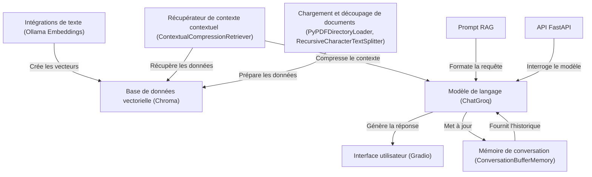

# Tutorial: RAG_ChatBot

Ce projet est un **chatbot** de formation assistée par *IA*. Il utilise une **base de données vectorielle** pour stocker des informations, et un modèle de langage pour répondre aux questions des utilisateurs, en tenant compte de l'historique de la conversation. Une interface utilisateur permet une interaction facile.

**Source Repository:** [https://github.com/regisx001/RAG_ChatBot](https://github.com/regisx001/RAG_ChatBot)

## Chapters

1. [Interface utilisateur (Gradio)
](01_interface_utilisateur__gradio__.md)
2. [Modèle de langage (ChatGroq)
](02_modèle_de_langage__chatgroq__.md)
3. [Prompt RAG
](03_prompt_rag_.md)
4. [Mémoire de conversation (ConversationBufferMemory)
](04_mémoire_de_conversation__conversationbuffermemory__.md)
5. [Récupérateur de contexte contextuel (ContextualCompressionRetriever)
](05_récupérateur_de_contexte_contextuel__contextualcompressionretriever__.md)
6. [Base de données vectorielle (Chroma)
](06_base_de_données_vectorielle__chroma__.md)
7. [Chargement et découpage de documents (PyPDFDirectoryLoader, RecursiveCharacterTextSplitter)
](07_chargement_et_découpage_de_documents__pypdfdirectoryloader__recursivecharactertextsplitter__.md)
8. [Intégrations de texte (Ollama Embeddings)
](08_intégrations_de_texte__ollama_embeddings__.md)
9. [API FastAPI
](09_api_fastapi_.md)

---

Generated by [AI Codebase Knowledge Builder](https://github.com/The-Pocket/Tutorial-Codebase-Knowledge)